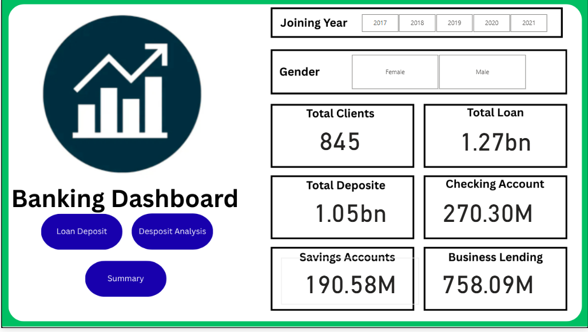

# Bank Customer Data Analysis  

## 📌 Project Overview  
This project demonstrates a complete **data analysis workflow**, starting from **Excel data**, importing it into **MySQL**, performing **Exploratory Data Analysis (EDA) with Python**, and finally building an **interactive Power BI dashboard** to visualize customer insights.  

The goal of this project is to uncover hidden patterns in customer financial data and provide data-driven insights that can help in **customer segmentation, account management, and business decision-making**.  

---

## 🛠️ Tools & Technologies  
- **Excel** → Raw dataset storage  
- **MySQL** → Data storage and management  
- **Python (Jupyter Notebook)** → EDA & statistical analysis  
  - Libraries: Pandas, NumPy, Matplotlib, Seaborn  
- **Power BI** → Interactive dashboard creation and visualization  

---

## 📂 Workflow  

### 1️⃣ Data Source (Excel)  
- Initial dataset was provided in **Excel format (.xlsx)** containing customer account details.  

### 2️⃣ Data Import into MySQL  
- The Excel dataset was imported into **MySQL** for structured data management.  
- Connected MySQL with Jupyter Notebook using the `mysql.connector` package:  


import mysql.connector

# Connect to server
cnx = mysql.connector.connect(
    host="127.0.0.1",
    port=3306,
    user="mike",
    password="s3cre3t!"
)
### 3️⃣ Exploratory Data Analysis (EDA) in Python  
Performed detailed **EDA** to understand relationships between variables, identify patterns, and detect correlations.  

#### 🔎 Key Insights from EDA:  
- The strongest **positive correlation** is among:  
  - **Bank Deposits** with **Checking Accounts**, **Saving Accounts**, and **Foreign Currency Accounts**.  
- This indicates that customers who maintain **high balances in one account type** often hold **substantial funds across other account types as well**.  
- Such insights are valuable for **customer profiling** and identifying **high-value customers**.  

### 4️⃣ Power BI Dashboard  
Designed an **interactive dashboard** in **Power BI** to present the insights visually.  

#### The dashboard highlights:  
- **Account distributions**  
- **Correlations** between different account types  
- **Trends and customer patterns** for business use
### 4️⃣ Power BI Dashboard  

Designed an **interactive dashboard** in **Power BI** to present the insights visually.  

---

#### **Dashboard 1: Account Distribution**
This dashboard shows the distribution of customer accounts across different account types.  
It helps to quickly identify the most common account types and their relative sizes.



---

#### **Dashboard 2: Correlation Analysis**
This dashboard highlights correlations between different account types such as Bank Deposits, Checking Accounts, and Savings Accounts.  
It helps identify high-value customers who maintain balances across multiple accounts.


---

#### **Dashboard 3: Customer Trends**
This dashboard tracks trends in customer activity and account growth over time.  
It provides insights into customer behavior patterns for strategic decision-making.


```python
